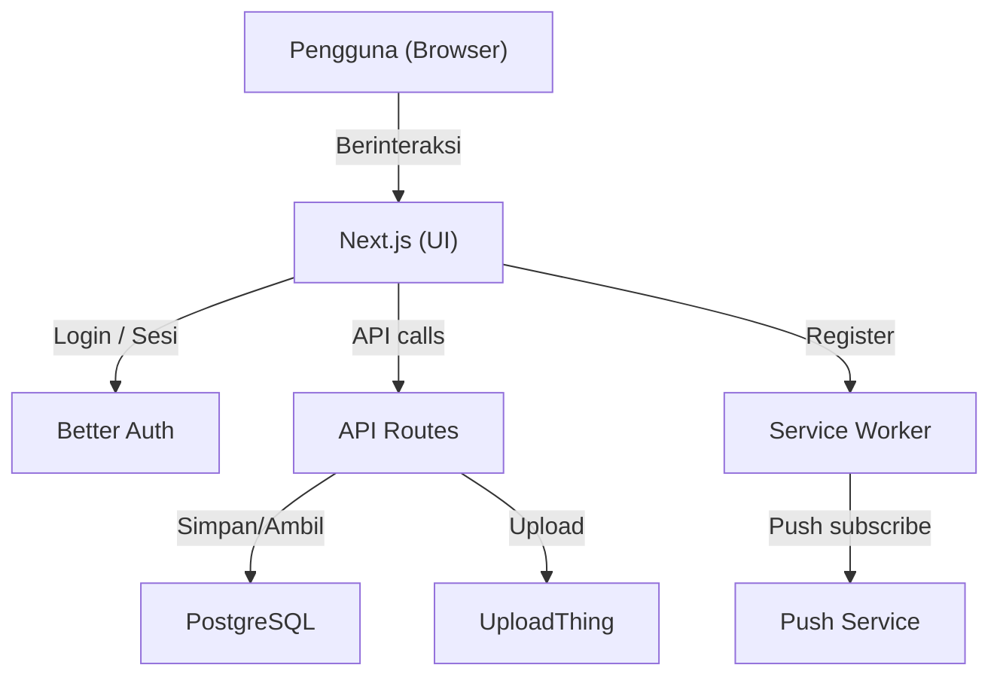
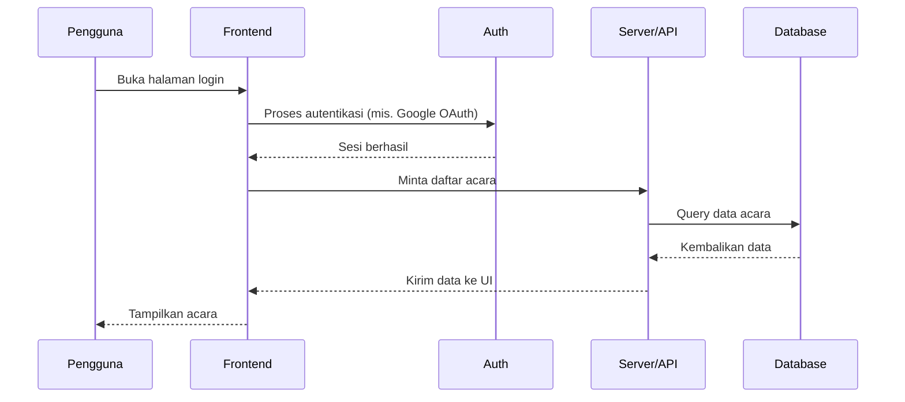

# PPI Bartın Web

### Ringkasan singkat

Dashboard PPI Bartın adalah website komunitas untuk mahasiswa Indonesia di Bartın, Turki. Pengguna dapat masuk (login), melengkapi profil, melihat dan mendaftar acara, serta membaca berita komunitas. Aplikasi ini juga mendukung notifikasi web dan unggah gambar untuk acara/berita.


### Ringkasan teknis

- Framework: Next.js (App Router)
- Bahasa: TypeScript + React
- Styling: Tailwind CSS
- Database: PostgreSQL dengan Prisma (client di `lib/generated/prisma`)
- Auth: Better Auth (terintegrasi dengan adapter Prisma) + Google OAuth
- Package manager: `pnpm` (wajib)

---

## Hal penting yang perlu diketahui

Dokumen ini hanya berisi ringkasan publik. Singkatnya:

- Aplikasi membutuhkan beberapa variabel .env (database, kredensial login, token upload, kunci publik untuk push). Pastikan diisi sebelum menjalankan.
- Data disimpan di database PostgreSQL (dikelola dengan Prisma di lapisan server).
- Upload file (gambar) dikelola oleh layanan UploadThing.
- Fitur notifikasi web memakai service worker di situs dan endpoint subscribe pada server.

Untuk panduan teknis dan catatan migrasi internal, lihat folder `.docs/` dalam repo (internal only).

---

## Prasyarat & instalasi cepat

1. Pastikan Node.js (LTS) terpasang.
2. Pasang pnpm (disarankan via Corepack):

```bash
corepack enable
corepack prepare pnpm@latest --activate
```

3. Clone dan install:

```bash
git clone <repo-url>
cd ppi-bartin-web
pnpm install
```

4. Copy file environment dan isi nilai yang diperlukan:

```bash
cp .env.example .env.local
```

5. Terapkan skema database (pilih `db push` atau `migrate dev` sesuai workflow Anda):

```bash
pnpm exec prisma db push
# atau untuk migrasi versi
pnpm exec prisma migrate dev
```

6. Jalankan server pengembangan:

```bash
pnpm dev
```

Lalu buka http://localhost:3000.

---

## Variabel lingkungan (ringkasan)

Beberapa variabel kunci yang biasanya perlu diisi (lihat juga `.env.example`):

- `DATABASE_URL`, `SHADOW_DATABASE_URL`
- `BETTER_AUTH_URL`, `BETTER_AUTH_SECRET`
- `GOOGLE_CLIENT_ID`, `GOOGLE_CLIENT_SECRET`
- `UPLOADTHING_TOKEN`
- `VAPID_PRIVATE_KEY` (server) dan `NEXT_PUBLIC_VAPID_PUBLIC_KEY` (klien)
- `NEXT_PUBLIC_SUPABASE_URL`, `NEXT_PUBLIC_SUPABASE_ANON_KEY` (jika pakai Supabase)

Catatan: variabel dengan prefix `NEXT_PUBLIC_` dimasukkan ke bundle klien — jangan letakkan secret sensitif di sana.

---

## Struktur singkat (untuk orientasi)

- `app/` — halaman dan routing (termasuk area yang membutuhkan login).
- `components/` — komponen UI yang dapat dipakai ulang.
- `features/` — area fitur yang mengelompokkan UI dan logika domain (mis. onboarding).
- `prisma/` — skema database.
- `public/` — aset statis (manifest, service worker, ikon).

Diagram arsitektur singkat:



Contoh alur sederhana (login → ambil data):



---

## Autentikasi & onboarding

- Otentikasi dikelola oleh Better Auth; integrasi server ada di `lib/auth`.
- Layout proteksi (`app/(protected)/layout.tsx`) memeriksa sesi dan me-redirect pengguna ke `/login`, `/register-profile`, atau `/complete-profile` bila profil belum lengkap.

---

## Upload & media

- Endpoint upload berada di `app/api/uploadthing/`.
- Aturan sumber gambar untuk Next/Image diset di `next.config.ts` (`images.remotePatterns`).

---

## Web push

- Service worker: `public/sw.js`
- Subscribe endpoint: `app/api/subscribe/route.ts`
- Server util untuk mengirim push di `lib/push` atau `lib/send-push.ts`

---

## Skrip penting

- `pnpm dev` — jalankan server dev
- `pnpm build` — build produksi
- `pnpm start` — jalankan hasil build
- `pnpm lint` — linting/ESLint

---

Jika Anda butuh panduan developer internal (daftar perubahan, mapping lama→baru, rencana migrasi), lihat folder `.docs/` — README ini hanya berisi ringkasan publik dan panduan cepat setup.

| `pnpm install` | Install + `prisma generate` (postinstall) |

---

## Build & deployment

1. Set semua variabel lingkungan di platform hosting (Vercel, dll.).
2. Pastikan `BETTER_AUTH_URL` mengarah ke domain produksi.
3. Terapkan skema DB di lingkungan produksi: `pnpm exec prisma migrate deploy` (bukan `db push`, kecuali Anda sengaja memakai alur khusus).
4. `pnpm build` harus sukses tanpa error TypeScript/ESLint.

---

## Lisensi & kontribusi

Proyek ini **private** (`"private": true` di `package.json`). Untuk kontribusi internal: buat branch fitur, PR dengan deskripsi jelas, dan ikuti konvensi commit tim.

---

*Dokumen ini menggambarkan struktur dan alur utama pada saat penulisan; sesuaikan jika modul baru ditambahkan.*
