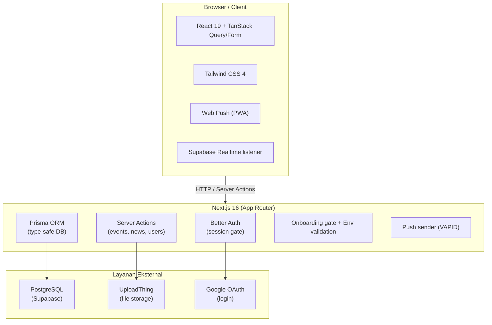
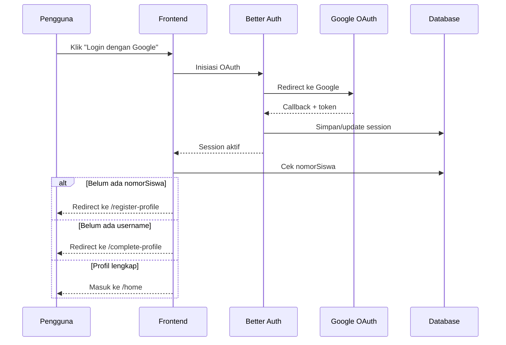
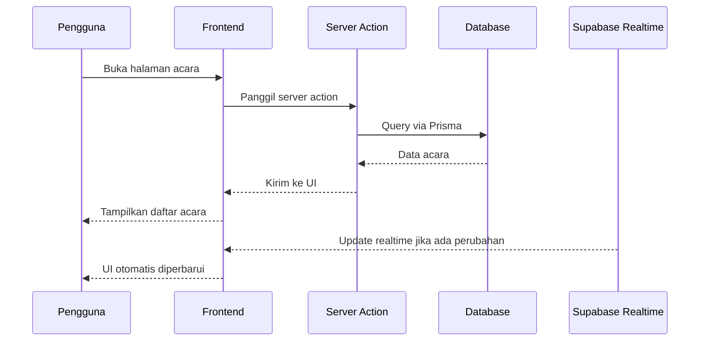
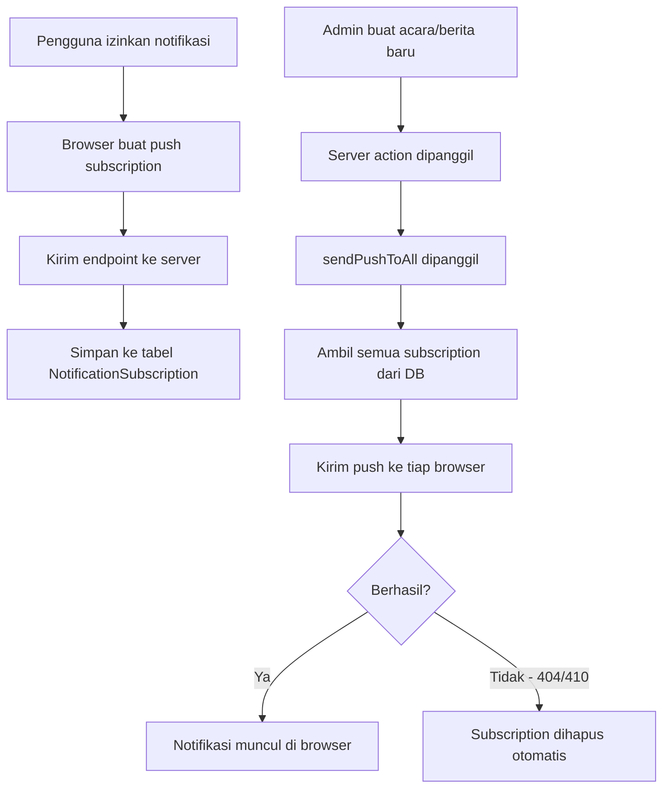
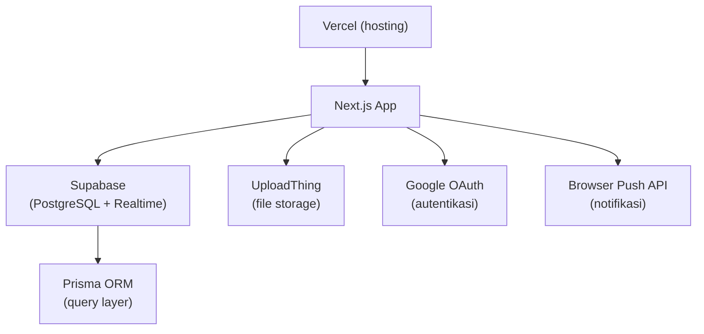

# Portal PPI Bartın

### Ringkasan singkat

Dashboard PPI Bartın adalah platform organisasi untuk mahasiswa Indonesia di Bartın, Turki. Pengguna dapat masuk (login), melengkapi profil, melihat dan mendaftar acara, serta membaca berita organisasi. Aplikasi ini juga mendukung notifikasi web dan unggah gambar untuk acara/berita.

>💡 Untuk petunjuk menggunakan dashboard ini, silahkan lompat ke [Persiapan sebelum mulai](#persiapan-sebelum-mulai)

---

## Daftar isi

- [Fitur utama](#fitur-utama)
- [Arsitektur & stack](#arsitektur--stack)
- [Alur sistem](#alur-sistem)
- [Infrastruktur & layanan eksternal](#infrastruktur--layanan-eksternal)
- [Persiapan sebelum mulai](#persiapan-sebelum-mulai)
- [Instalasi lokal](#instalasi-lokal)
- [Konfigurasi variabel lingkungan](#konfigurasi-variabel-lingkungan)
- [Menjalankan aplikasi](#menjalankan-aplikasi)
- [Deploy ke produksi](#deploy-ke-produksi)
- [Struktur folder](#struktur-folder)
- [Lisensi](#lisensi)

---

## Fitur utama

- Login dengan akun Google (via Google OAuth)
- Onboarding profil bertahap (nomor siswa → username)
- Manajemen acara: lihat, daftar, batalkan
- Berita dan artikel organisasi
- Notifikasi web (browser push notifications)
- Upload gambar untuk acara dan berita
- Ekspor data peserta (CSV)
- Realtime update (via Supabase)

---

## Arsitektur & stack

Aplikasi dibangun dengan tiga lapisan utama: client, server, dan layanan eksternal.



**Tech stack lengkap:**

| Kategori | Teknologi |
|---|---|
| Framework | Next.js 16 (App Router) |
| Bahasa | TypeScript + React 19 |
| Styling | Tailwind CSS 4 |
| Database | PostgreSQL via Prisma 7 |
| Auth | Better Auth + Google OAuth |
| Realtime | Supabase JS |
| Upload | UploadThing |
| Notifikasi | Web Push + VAPID |
| Client data | TanStack Query + TanStack Form |
| Deployment | Vercel |
| Package manager | pnpm (wajib) |

---

## Alur sistem

### Alur login dan onboarding



### Alur permintaan data (contoh: daftar acara)



### Alur notifikasi web



---

## Infrastruktur & layanan eksternal



Semua layanan eksternal tersedia dengan tier gratis untuk penggunaan organisasi skala kecil-menengah.

---

## Persiapan sebelum mulai

Sebelum menjalankan aplikasi ini, kamu perlu menyiapkan beberapa akun dan kredensial dari layanan eksternal berikut.

### 1. Database — Supabase

Aplikasi ini menggunakan PostgreSQL yang di-host di Supabase.

1. Buat akun di [supabase.com](https://supabase.com)
2. Buat project baru
3. Masuk ke **Project Settings → Database**
4. Salin **Connection string (URI)** — ini untuk `DATABASE_URL`
5. Masuk ke **Project Settings → API**
6. Salin **Project URL** → `NEXT_PUBLIC_SUPABASE_URL`
7. Salin **anon public key** → `NEXT_PUBLIC_SUPABASE_ANON_KEY`

> Aktifkan juga **Realtime** untuk tabel `user`, `events`, dan `participants` di menu **Database → Replication**.

---

### 2. Login Google — Google OAuth

Aplikasi menggunakan Google sebagai satu-satunya metode login.

1. Buka [console.cloud.google.com](https://console.cloud.google.com)
2. Buat project baru (atau gunakan yang sudah ada)
3. Masuk ke **APIs & Services → OAuth consent screen** — isi nama aplikasi dan email
4. Masuk ke **APIs & Services → Credentials → Create Credentials → OAuth 2.0 Client ID**
5. Pilih tipe **Web application**
6. Tambahkan ke **Authorized redirect URIs**:
   - Untuk lokal: `http://localhost:3000/api/auth/callback/google`
   - Untuk produksi: `https://domain-kamu.com/api/auth/callback/google`
7. Salin **Client ID** → `GOOGLE_CLIENT_ID`
8. Salin **Client Secret** → `GOOGLE_CLIENT_SECRET`

---

### 3. Upload gambar — UploadThing

Gambar untuk profil, acara, dan berita disimpan di UploadThing.

1. Buat akun di [uploadthing.com](https://uploadthing.com)
2. Buat app baru
3. Masuk ke **Dashboard → API Keys**
4. Salin token → `UPLOADTHING_TOKEN`

---

### 4. Notifikasi web — VAPID keys

VAPID key digunakan untuk mengotorisasi pengiriman push notification dari server ke browser pengguna.

Generate pasangan key baru dengan perintah berikut (cukup sekali):

```bash
npx web-push generate-vapid-keys
```

Salin hasilnya:
- **Public Key** → `NEXT_PUBLIC_VAPID_PUBLIC_KEY`
- **Private Key** → `VAPID_PRIVATE_KEY`

> Simpan private key dengan aman — jangan commit ke git.

---

### 5. Better Auth secret

Secret key untuk mengenkripsi data sesi. Generate dengan perintah:

```bash
openssl rand -base64 32
```

Salin hasilnya → `BETTER_AUTH_SECRET`

---

## Instalasi lokal

**Prasyarat:** Node.js LTS, pnpm

```bash
# 1. Clone repo
git clone <repo-url>
cd ppi-bartin-web

# 2. Install dependencies
pnpm install

# 3. Salin file env dan isi nilainya
cp .env.example .env
```

Lanjut ke bagian konfigurasi di bawah.

---

## Konfigurasi variabel lingkungan

Buka file `.env` dan isi semua nilai berikut:

```env
# Database (dari Supabase)
DATABASE_URL=postgresql://...
SHADOW_DATABASE_URL=postgresql://...

# Supabase
NEXT_PUBLIC_SUPABASE_URL=https://xxxx.supabase.co
NEXT_PUBLIC_SUPABASE_ANON_KEY=eyJ...

# Better Auth
BETTER_AUTH_URL=http://localhost:3000
BETTER_AUTH_SECRET=isi-dengan-hasil-openssl

# Google OAuth
GOOGLE_CLIENT_ID=xxxx.apps.googleusercontent.com
GOOGLE_CLIENT_SECRET=GOCSPX-xxxx

# UploadThing
UPLOADTHING_TOKEN=eyJ...

# Web Push (VAPID)
NEXT_PUBLIC_VAPID_PUBLIC_KEY=BBW...
VAPID_PRIVATE_KEY=q1w...
```

> Untuk produksi, ubah `BETTER_AUTH_URL` ke domain kamu, misalnya `https://ppi-bartin.com`.

---

## Menjalankan aplikasi

```bash
# Terapkan skema database
pnpm exec prisma db push

# Jalankan server development
pnpm dev
```

Buka [http://localhost:3000](http://localhost:3000).

---

## Deploy ke produksi

Aplikasi ini dirancang untuk di-deploy di [Vercel](https://vercel.com).

1. Push repo ke GitHub
2. Import project di Vercel
3. Isi semua environment variables di **Vercel → Settings → Environment Variables**
4. Pastikan `BETTER_AUTH_URL` diset ke domain produksi
5. Tambahkan URL produksi ke **Google OAuth redirect URIs** (lihat langkah 6 di bagian Google OAuth)
6. Terapkan skema database di produksi:

```bash
pnpm exec prisma migrate deploy
```

---

## Struktur folder

```
ppi-bartin-web/
├── app/              # Halaman dan routing (Next.js App Router)
├── components/       # Komponen UI yang dapat dipakai ulang
├── features/         # Logika dan UI per fitur (onboarding, dll.)
├── lib/              # Konfigurasi dan helper (auth, prisma, env)
├── prisma/           # Skema database
├── public/           # Aset statis (manifest, service worker, ikon)
└── server/           # Server actions dan data fetching
```

---

## Lisensi

Proyek ini bersifat **private**. Untuk kontribusi atau pertanyaan, hubungi tim PPI Bartın.